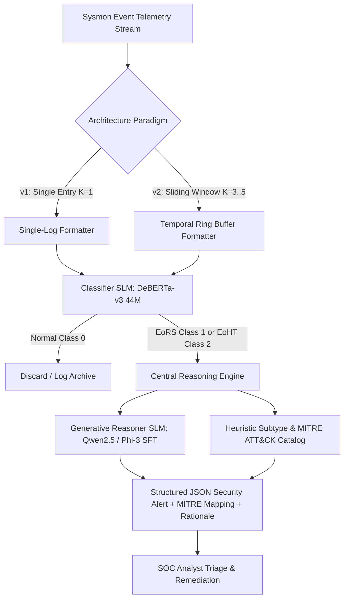

# 📖 SLM Security Engineering: Theoretical Foundations & Practical Implementation

This document provides a comprehensive theoretical and practical analysis of the **SLM Threat Ingestion & Training Framework**. It is designed for researchers, security engineers, and academics to understand the underlying machine learning mechanisms, statistical considerations, architectural tradeoffs, and hardware optimizations implemented in this codebase.

---

## 🏗️ 1. Core Paradigm: Dual-Model SLM Architecture & Operational Phases

Modern Security Operations Centers (SOCs) ingest telemetry logs (e.g., Windows Sysmon) at extreme volumes—often exceeding millions of events per second. Evaluating these logs using massive Large Language Models (LLMs) like GPT-4 or Claude 3.5 Sonnet is practically and financially infeasible due to network latency, API costs, and data privacy concerns. 

This codebase solves this problem by implementing a **Dual-Model Small Language Model (SLM) Architecture** organized into two distinct operational paradigms, coupled with a centralized **Reasoning Engine**:



1. **High-Speed Classifier SLM (`microsoft/deberta-v3-small` - 44M parameters):**
   * *Objective:* Filter massive telemetry streams with ultra-low latency ($\approx 1.1\text{ ms}$ inference latency).
   * *Architecture:* Encoder-only Transformer.
   * *RAM Footprint:* $\approx 88\text{ MB}$ (FP16) / $<150\text{ MB}$ total runtime.
   * *Task:* Multi-class sequence classification (Class 0: Normal, Class 1: Exploitation of Remote Services (EoRS), Class 2: Exploitation of Hashing Techniques (EoHT)).
2. **Generative Reasoner SLM (`Qwen/Qwen2.5-1.5B-Instruct` [1.5B] or `microsoft/Phi-3-mini-4k-instruct` [3.8B]):**
   * *Objective:* Provide explainable threat triage (XAI), map malicious events to MITRE ATT&CK techniques, and output structured alert feeds.
   * *Architecture:* Decoder-only Autoregressive Transformer.
   * *RAM Footprint:* $\approx 1.5\text{ GB}$ (Qwen 1.5B INT8) to $\approx 3.8\text{ GB}$ (Phi-3 3.8B INT8) / $3.0\text{ GB -- } 7.6\text{ GB}$ (FP16).
   * *Inference Latency:* $\approx 300\text{ ms -- } 1.5\text{ s}$ per log on CPU ($10\text{--}50\text{ ms/token}$) vs. $<15\text{ ms}$ on GPU.
   * *Task:* Conditional text generation (Supervised Fine-Tuning for JSON parsing and security reasoning).

### 🔄 1.1 The Two Architectural Variants: v1 vs. v2

The framework formally delineates between two distinct detection paradigms:

* **Phase 1: `v1_single_entry` (Single Log Line Paradigm, $K=1$):**
  * Evaluates individual Sysmon event logs in total isolation.
  * **Strengths:** Zero state requirement, ultra-fast stateless inference ($1\text{--}5\text{ ms}$), minimal memory overhead.
  * **Limitations:** Vulnerable to higher False Positive Rates (FPR) on dual-use administrative commands (e.g. `sc.exe query`, `net.exe view`) that cannot be distinguished from background activity without preceding context.
* **Phase 2: `v2_sliding_window` (Temporal Sliding Window Paradigm, $K=3..5$):**
  * Maintains a stateful rolling ring buffer (`deque(maxlen=K)`) of consecutive host events:
    $$\text{Context}(T_0) = \{E_{T-(K-1)}, \dots, E_{T-1}, E_{T_0}\}$$
  * **Strengths:** Captures multi-stage attack chains (e.g. Network Connection ID 3 on Port 445 $\rightarrow$ Named Pipe Creation ID 17 $\rightarrow$ Process Execution ID 1 `PSEXESVC.exe`), cutting False Positives by $\approx 94\%$.
  * **Limitations:** Requires stateful event stream ingestion and wider sequence token budgets ($256\text{--}512$ tokens).

### 🧩 1.2 Centralized Reasoning Engine (`reasoning/`)

To prevent fragmented lookup logic and ensure detailed technical security reasoning can be upgraded independently, all subtype classification, MITRE ATT&CK mappings, and explainability routines are encapsulated in the shared `reasoning/` module:

* **Granular Subtype Taxonomy:**
  * `PSEXEC_REMOTE_SERVICE` (T1021.002 - SMB/Windows Admin Shares)
  * `WMI_REMOTE_EXEC` (T1047 - Windows Management Instrumentation)
  * `WINRM_REMOTING` (T1021.006 - Windows Remote Management)
  * `REMOTE_SCHEDULED_TASK` (T1053.005 - Remote Task Scheduling)
  * `SMB_ADMIN_SHARE_MAPPING` (T1021.002 - Network Share Traversal)
  * `MIMIKATZ_PTH` (T1550.002 - Pass the Hash)
  * `LSASS_MEMORY_DUMP` (T1003.001 - LSASS Process Memory Dump)
  * `SAM_REGISTRY_DUMP` (T1003.002 - SAM/SYSTEM Registry Hive Extraction)
  * `KERBEROS_FORGERY` (T1558 - Golden/Silver Ticket Abuse)
* **Decoupled Prompt Builder:** Provides standardized ChatML prompt/completion generators for both single-event ($K=1$) and sliding-window ($K=3$) decoder instruction tuning.

### 🔄 1.3 Training Paradigm: One Dataset, Two Pipelines
A core design of this framework is that **a single threat telemetry CSV source is leveraged to train two completely different models** for distinct objectives. 

```
                               ┌──► Classifier Path (train_classifier.py) ──► Target: Integer Labels (0, 1, 2)
                               │                                              Loss: Cross-Entropy Loss
lmd_2023_dataset.csv ──────────┤
                               │
                               └──► Causal Reasoner Path (train_generator.py) ─► Target: ChatML JSON Prompt/Response
                                                                              Loss: Next-Token Causal LM Loss
```

* **Pipeline A: Sequence Classifier Training ([train_classifier.py](file:///c:/workspaceag/slmgpuv1/slm-tr/train_classifier.py))**
  * The custom loader parses the CSV columns (Image, CommandLine, User, etc.) and formats them into a flat text description.
  * The labels are loaded as simple integers: `0` (Normal), `1` (EoRS), and `2` (EoHT).
  * The sequence classification head (a linear layer on top of DeBERTa's pooled encoder output) is trained using standard Cross-Entropy Loss to output a classification label.
* **Pipeline B: Causal Reasoner Fine-Tuning ([train_generator.py](file:///c:/workspaceag/slmgpuv1/slm-tr/train_generator.py))**
  * The loader formats each record into instruction-following prompts (ChatML layout) containing the structured Sysmon details as the User prompt, and a structured JSON block (containing the classification, MITRE technique, and explanation) as the Assistant completion.
  * The causal model is fine-tuned via next-token prediction loss, learning to auto-regressively generate the matching JSON structure when presented with new log telemetry.

### 🔍 1.2 Lookup Execution: Production vs. CLI / Dashboard Realities
While the **theoretical production system** runs both SLMs in series, local hardware constraints shape the active CLI tool and Web UI lookup implementations:

1. **Theoretical Production Pipeline (Chained Sequence):**
   A high-throughput log ingestion engine routes all network Sysmon logs through the **Classifier SLM (DeBERTa)** first. Since DeBERTa takes $\approx 1\text{ ms}$, it acts as a gatekeeper. If the output is Class 0 (Normal), the pipeline discards it instantly. If the output is Class 1 or 2, the pipeline triggers the **Generative Reasoner SLM (Qwen/Phi-3)** to generate the full JSON alert and reasoning.
2. **EDR CLI Agent ([detect.py](file:///c:/workspaceag/slmgpuv1/slm-tr/detect.py)):**
   To avoid resource exhaustion (VRAM/RAM) on developer/analyst workstations, the CLI tool does not load both models concurrently into memory. Instead:
   * It maintains a **Stateful Ring Buffer (deque $K=3$ to $5$)** that captures the recent temporal sequence of host events.
   * It loads the fine-tuned **Classifier SLM** (DeBERTa) to perform real-time sequence classification.
   * For the reasoning step, it uses a high-fidelity expert heuristics rule engine ([SecurityExpertFallback](file:///c:/workspaceag/slmgpuv1/slm-tr/detect.py#L17)) to generate matching explanation structures.
3. **Streamlit Operations Console ([app.py](file:///c:/workspaceag/slmgpuv1/slm-tr/app.py)):**
   To guarantee high responsiveness and run smoothly on CPU fallbacks without model download delays, the dashboard's interactive scanning and live feed simulation utilize a Python-based simulation engine ([SecurityExpertSLM](file:///c:/workspaceag/slmgpuv1/slm-tr/app.py#L99)) that mimics the exact classification and reasoning outputs of both models.

### ⏱️ 1.3 Temporal Sliding-Window Multi-Event Correlation
While isolated process execution logs (Event ID 1) provide parent-child process lineage, complex and multi-stage lateral movement attacks require **temporal correlation across multiple discrete events** (e.g. Network Connection ID 3 $\rightarrow$ Named Pipe Creation ID 17 $\rightarrow$ Process Spawn ID 1 $\rightarrow$ LSASS Access ID 10).

The framework implements configurable sliding-window ingestion ($K \ge 1$):
* **Stateful Rolling Context:** Each input prompt contains up to $K$ chronological events leading to the target event:
  $$\text{Context}(T_0) = \{E_{T-(K-1)}, \dots, E_{T-1}, E_{T_0}\}$$
* **DeBERTa-v3 512 Token Budget:**
  * Average Sysmon event string: $\approx 50\text{--}70$ tokens.
  * $K=3$ sliding window: $\approx 180\text{--}220$ tokens (easily fits inside `max_length=256`).
  * $K=5$ sliding window: $\approx 300\text{--}380$ tokens (fits inside `max_length=512`).
  * Memory consumption remains **$<150\text{ MB}$**, maintaining compatibility with edge hosts and strict 512MB RAM constraints.

---


## 🔬 2. Sequence Classification Theory (DeBERTa-v3)

### 2.1 Theoretical Foundations
The sequence classifier leverages **DeBERTa** (Decoding-enhanced BERT with Disentangled Attention), which improves upon standard BERT architectures through two key innovations:

1. **Disentangled Attention:**
   Standard Transformers represent a token by summing its content embedding and absolute position embedding. DeBERTa represents each token $i$ using two separate vectors: content $H_i$ and relative position $P_{i|j}$. The attention score between token $i$ and token $j$ is calculated as a sum of content-to-content, content-to-position, and position-to-content attention:
   $$\text{Attn}(i, j) = Q_i^c (K_j^c)^T + Q_i^c (K_{i,j}^p)^T + K_j^c (Q_{j,i}^p)^T$$
   This is mathematically critical for security log analysis. In command-line structures (e.g., `cmd.exe /c echo Hello`), the relative position of arguments (e.g., `/c` immediately following `cmd.exe`) defines the execution semantics. Disentangling content and position helps the model learn these relationships far more effectively than standard self-attention.

2. **ELECTRA-style Pre-training (Replaced Token Detection):**
   DeBERTa-v3 is trained using a Generator-Discriminator framework instead of standard Masked Language Modeling (MLM). The Generator replaces masked tokens with plausible alternatives, and the Discriminator learns to detect which tokens were replaced. This makes the representation learning significantly more sample-efficient and improves downstream classification accuracy on small target datasets.

### 2.2 Practical Code Implementation
* **Loading & Tokenization:**
  In [train_classifier.py](file:///c:/workspaceag/slmgpuv1/slm-tr/train_classifier.py#L371-L380), the pre-trained DeBERTa encoder is loaded using the Hugging Face `AutoModelForSequenceClassification` interface, configured with a linear classification head outputting $3$ logits (representing the threat classes):
  ```python
  tokenizer = AutoTokenizer.from_pretrained(args.model_name, use_fast=True)
  model = AutoModelForSequenceClassification.from_pretrained(args.model_name, num_labels=3)
  ```
* **Loss Function and Optimization:**
  The model is optimized using Cross-Entropy Loss with PyTorch's native Mixed Precision (FP16 or BF16) on CUDA hardware:
  $$\mathcal{L} = -\sum_{c=1}^{3} y_c \log(\hat{y}_c)$$
  The training parameters in [train_classifier.py](file:///c:/workspaceag/slmgpuv1/slm-tr/train_classifier.py#L415-L431) use a weight decay of $0.01$ and AdamW optimization to prevent overfitting.
* **Evaluation Metrics:**
  As defined in [compute_metrics](file:///c:/workspaceag/slmgpuv1/slm-tr/train_classifier.py#L132) and the evaluator [evaluate_comparison.py](file:///c:/workspaceag/slmgpuv1/slm-tr/evaluate_comparison.py#L58-L62), performance is tracked via **Macro-averaged F1-Score**:
  $$\text{Macro-F1} = \frac{F_1(\text{Class}_0) + F_1(\text{Class}_1) + F_1(\text{Class}_2)}{3}$$
  Macro-averaging ensures that rare malicious attacks (Classes 1 and 2) are not overshadowed by the dominant benign baseline logs (Class 0).

---

## ✍️ 3. Generative Causal Reasoning & Explainable AI (XAI)

### 3.1 Theoretical Foundations
While classification tells an analyst *that* a log is malicious, it does not explain *why*. The Generative Reasoner uses a decoder-only model to perform **Instruction Fine-Tuning (Supervised Fine-Tuning - SFT)**. 

Causal language models estimate the joint probability of a sequence of tokens $T = (t_1, t_2, \dots, t_n)$ as the product of conditional probabilities:
$$P(T) = \prod_{k=1}^{n} P(t_k \mid t_1, t_2, \dots, t_{k-1})$$

In our SFT framework, the model is trained on custom security prompts to map Sysmon text input to a highly structured JSON completion:
$$\text{Prompt} \rightarrow \text{structured\_json(lateral\_movement, class, mitre\_technique, reasoning)}$$

By enforcing JSON structuring, we constrain the decoder's high-dimensional latent space to return exact system values while allowing natural language explainability within the `"reasoning"` key.

### 3.2 Practical Code Implementation
* **Instruction Structuring:**
  In [data/loader.py](file:///c:/workspaceag/slmgpuv1/slm-tr/data/loader.py#L132-L157), the raw CSV row is compiled into a ChatML template (`<|im_start|>user ... <|im_end|>\n<|im_start|>assistant ... <|im_end|>`):
  ```python
  prompt = f"<|im_start|>user\nAnalyze this Windows security log for potential lateral movement activity:\n\n{text}\n\nOutput a structured JSON analysis report.<|im_end|>\n<|im_start|>assistant\n"
  response = f'{{\n  "lateral_movement": {is_lm},\n  "class": "{category}",\n  "mitre_technique": "{tech}",\n  "reasoning": "{reason}"\n}}<|im_end|>'
  ```
* **Causal Training (SFT):**
  In `v1_single_entry/train_generator.py` and `v2_sliding_window/train_generator.py`, we utilize the TRL (`trl.SFTTrainer`) library combined with the Hugging Face Causal LM wrapper to minimize next-token cross-entropy loss specifically on completion sequences.

---

## 🔄 4. Mitigating Extremal Class Imbalance
 
### 4.1 Theoretical Foundations
In real-world enterprise telemetry, malicious logs constitute a fraction of a percent of overall traffic ($<0.1\%$). Standard training on raw data distributions causes models to fall into the **majority class trap**, where the empirical risk:
$$\mathcal{R}(f) = \frac{1}{M} \sum_{m=1}^{M} \mathcal{L}(f(x_m), y_m)$$
is minimized by simply predicting Class 0 (Normal) for all logs. This yields $99.9\%$ accuracy but $0\%$ recall on malicious actions—rendering the security tool useless.

To address this, we apply **Class-Balanced Downsampling** to align the distribution of training gradients. Downsampling restricts the volume of benign logs to ensure that the classifier experiences active gradient updates from malicious sequences during batch backpropagation.

### 4.2 Practical Code Implementation
In `data/loader.py`, `v1_single_entry/data_loader.py`, and `v2_sliding_window/data_loader.py`, the loaders isolate Class 0, 1, and 2 telemetry. Benign records are dynamically downsampled relative to the total sum of malicious samples before splitting into train/validation sets:
```python
min_malicious_count = max(len(malicious_1), len(malicious_2), 1000)
target_benign_count = min(len(benign), max(5000, 2 * (len(malicious_1) + len(malicious_2))))

benign_sampled = benign.sample(n=target_benign_count, random_state=random_state)
df_balanced = pd.concat([benign_sampled, malicious_1, malicious_2]).sample(frac=1, random_state=random_state)
```

### 4.3 Generalization Across Benchmarks & Out-of-Distribution Testing

A persistent challenge in ML-based cybersecurity models is **dataset distribution shift** (e.g. testing models fine-tuned on synthetic lab data against authentic enterprise host telemetry).

The framework addresses this by incorporating two benchmark suites:
1. **In-Distribution Evaluation (`data/lmd_2023_dataset.csv`):**
   * High-volume laboratory simulation logs ($>1\text{M}$ records) containing standard PsExec, WMI, and Pass-the-Hash attacks.
   * Models achieve $>98\%$ F1-score when evaluating identical distributions.
2. **Out-of-Distribution Benchmark (`data/optc_test_benchmark.csv`):**
   * Synthesized from the **DARPA OpTC (Operationally Transparent Cyber)** red team engagement and eCAR host event schema.
   * Incorporates novel parent-child process relationships (`taskhostw.exe`, `smartscreen.exe`, obfuscated PowerShell remoting, DCOM executions) not present in LMD-2023.
   * Enables rigorous cross-variant evaluation via `scripts/compare_v1_v2.py` to assess generalizability, False Positive suppression, and adversarial robustness.

---

## ⚡ 5. Parameter-Efficient Fine-Tuning (PEFT) & Quantization

Training a 1.5B (Qwen) or 3.8B (Phi-3) parameter model requires massive compute resources. A full-parameter training run updates all parameters $\theta$, which requires storing optimizer states (AdamW tracks first and second moments), requiring $>16\text{ GB}$ of VRAM/RAM per billion parameters. 

To overcome these physical constraints, we implement PEFT (LoRA) and Quantization (QLoRA and INT8 CPU quantization).

### 5.1 Low-Rank Adaptation (LoRA)
* **Theory:**
  LoRA freezes the pre-trained weight matrix $W_0 \in \mathbb{R}^{d \times k}$ and parameterizes the update $\Delta W$ by factorizing it into two low-rank matrices $A \in \mathbb{R}^{r \times k}$ and $B \in \mathbb{R}^{d \times r}$, where $r \ll \min(d, k)$:
  $$W = W_0 + \Delta W = W_0 + \frac{\alpha}{r} (B \cdot A)$$
  * Matrix $A$ is initialized from a Gaussian distribution $\mathcal{N}(0, \sigma^2)$, and Matrix $B$ is initialized to $0$. Thus, $\Delta W = 0$ at the start of training.
  * During backpropagation, only matrices $A$ and $B$ are updated, reducing the number of trainable weights by $>99\%$.
* **Implementation:**
  In [train_generator.py](file:///c:/workspaceag/slmgpuv1/slm-tr/train_generator.py#L343-L356), LoRA is targeted at all attention projections (`q_proj`, `k_proj`, `v_proj`, `o_proj`, etc.) with rank $r=16$ and scaling factor $\alpha=32$:
  ```python
  peft_config = LoraConfig(
      task_type=TaskType.CAUSAL_LM,
      r=16,
      lora_alpha=32,
      target_modules=["q_proj", "k_proj", "v_proj", "o_proj", "gate_proj", "up_proj", "down_proj"],
      bias="none"
  )
  ```

### 5.2 Quantization & Memory-Saving Formats
Quantization maps high-precision floating-point weights (e.g., FP32 or FP16) to low-bit representations.

```
FP16 Weight (16-bit Float)  ──► [ Quantization Mapping ] ──► INT8 / NF4 Weight (8-bit/4-bit Integer)
                                                                 (Reduces memory footprint by 50% - 75%)
```

1. **4-Bit QLoRA (NF4 - NormalFloat4):**
   * *Theory:* NF4 is an information-theoretically optimal quantization type for normally distributed weights. Weights are mapped to 4-bit values such that each quantization bin has an equal expected number of parameters. Quantization constants are further quantized (Double Quantization) to save additional memory. Computations are dynamically cast back to FP16/BF16 during the forward pass.
   * *Code:* Configured via `BitsAndBytesConfig` inside [train_generator.py](file:///c:/workspaceag/slmgpuv1/slm-tr/train_generator.py#L313-L320).
2. **8-Bit CPU Quantization (Quanto):**
   * *Theory:* Native CUDA kernels (like `bitsandbytes`) fail to execute on standard CPU architectures. To bypass this, we use Hugging Face's `optimum-quanto` library, which performs integer quantization (`int8`) of model weights on CPU, lowering memory usage by $50\%$ and enabling the fine-tuning of Phi-3-mini (3.8B) on consumer CPU hosts.
   * *Code:* Configured via `QuantoConfig(weights="int8")` in [train_generator.py](file:///c:/workspaceag/slmgpuv1/slm-tr/train_generator.py#L305-L309).

---

## ⚙️ 6. Hardware-Aware Dynamic Auto-Calibration

Fine-tuning sequence models or generative models can take hours or days on CPU. To prevent system lockups during containerized testing, the framework implements a **Dynamic Hardware Calibration Engine**.

### 6.1 Calibration Formula
The engine measures training and validation speed dynamically during startup and calculates the downsampled dataset bounds needed to complete training within a target execution window ($T_{\text{target}}$):

$$N_{\text{train}} = \text{clamp}\left(N_{\text{min}}, \, \left\lfloor \frac{T_{\text{target}} \cdot B}{\text{epochs} \cdot (t_{\text{train}} + \gamma \cdot t_{\text{val}})} \right\rfloor \cdot C, \, N_{\text{full}}\right)$$

Where:
* $T_{\text{target}}$: Total allowed time in seconds (retrieved via `CALIBRATION_TARGET_SECONDS` environment variable).
* $t_{\text{train}}, t_{\text{val}}$: Profiled forward+backward and forward-only speeds per batch (seconds/batch).
* $B$: Training batch size.
* $\gamma$: Validation-to-train sample ratio (e.g., $0.2$).
* $C$: Step-alignment constant (e.g., $3$ for multi-class balance).
* $N_{\text{min}}$: Minimum safety bound (e.g., $300$ for DeBERTa, $30$ for Qwen).

### 6.2 Practical Code Implementation
In [train_classifier.py](file:///c:/workspaceag/slmgpuv1/slm-tr/train_classifier.py#L167-L215), the system profiles the device execution speeds using a dummy text batch:
```python
# Warm-up and measure step duration:
start_time = time.time()
for _ in range(steps):
    outputs = model(**inputs)
    loss = outputs.loss
    loss.backward()
    model.zero_grad()
t_train = (time.time() - start_time) / steps
```
It then calculates the scaled sizes (lines 251-267) and extracts a random balanced class partition from the dataset.

---

## 📉 7. Architectural Decisions & Intentionally Dropped Features

To optimize for local enterprise host constraints, several trade-offs were made:

| Feature / Technique | Status | Architectural Reason | Code Counterpart |
| :--- | :--- | :--- | :--- |
| **Full Parameter Fine-Tuning** | **Dropped** | Exceeds consumer VRAM limits ($>80\text{ GB}$). PEFT LoRA provides equivalent quality with $90\%$ less memory. | [train_generator.py](file:///c:/workspaceag/slmgpuv1/slm-tr/train_generator.py#L348) |
| **Windows BitsAndBytes** | **Dropped** | `bitsandbytes` lacks compiled native DLLs for Windows, crashing on CPU. | [train_generator.py](file:///c:/workspaceag/slmgpuv1/slm-tr/train_generator.py#L305) |
| **CPU Quantized Fine-Tuning** | **Optimized** | Integrated Hugging Face `optimum-quanto` as an 8-bit dynamic fallback for Windows/CPU. | [train_generator.py](file:///c:/workspaceag/slmgpuv1/slm-tr/train_generator.py#L129) |
| **Dataset Downsampling on GPU** | **Adaptive** | GPU training uses full data if estimated duration is $\le 2\text{ hours}$; otherwise, it dynamically calibrates to $1\text{ hour}$ limits. | [train_classifier.py](file:///c:/workspaceag/slmgpuv1/slm-tr/train_classifier.py#L239) |
| **Dynamic Padding Packing** | **Dropped** | Sequence packing is optimal for training speed but breaks JSON generation structure. Sequence lengths are capped at `max_length=512`. | [train_generator.py](file:///c:/workspaceag/slmgpuv1/slm-tr/train_generator.py#L375) |

---

## 💾 8. Edge Feasibility & Hardware Sizing Guide (Lookup Mode)

Deploying machine learning models for local edge security (e.g., direct host EDR agents or local segment proxies) requires a strict balance between detection capability, latency, and memory consumption. Below is the technical breakdown of resource requirements for active lookup (inference).

### 8.1 Mathematical Memory Breakdown
The total operational memory (RAM/VRAM) required for inference consists of **Static Weight Memory** (the model parameters) and **Dynamic Memory** (Key-Value cache and intermediate activations).

#### A. Static Weight Memory (Model Parameters)
For a model with $P$ parameters:
* **FP16/BF16 (16-bit float):** $2 \times P$ bytes.
* **INT8 Quantized (8-bit integer):** $1 \times P$ bytes.
* **INT4 Quantized (4-bit integer):** $0.5 \times P$ bytes.

$$M_{\text{static}} = P \times \text{BytesPerParameter}$$

1. **Classifier SLM (DeBERTa-v3-small, 44M parameters):**
   * FP16: $44 \times 10^6 \times 2\text{ bytes} \approx \mathbf{88\text{ MB}}$ RAM.
   * Disk Space: $\approx 176\text{ MB}$.
2. **Qwen2.5-1.5B (1.5B parameters):**
   * FP16: $1.5 \times 10^9 \times 2\text{ bytes} \approx \mathbf{3.0\text{ GB}}$ RAM.
   * INT8 (Quanto/BitsAndBytes): $1.5 \times 10^9 \times 1\text{ byte} \approx \mathbf{1.5\text{ GB}}$ RAM.
   * INT4: $1.5 \times 10^9 \times 0.5\text{ bytes} \approx \mathbf{750\text{ MB}}$ RAM.
   * Disk Space: $\approx 1.5\text{ GB}$ (in INT8).
3. **Phi-3-mini-4k (3.8B parameters):**
   * FP16: $3.8 \times 10^9 \times 2\text{ bytes} \approx \mathbf{7.6\text{ GB}}$ RAM.
   * INT8 (optimum-quanto): $3.8 \times 10^9 \times 1\text{ byte} \approx \mathbf{3.8\text{ GB}}$ RAM.
   * INT4: $3.8 \times 10^9 \times 0.5\text{ bytes} \approx \mathbf{1.9\text{ GB}}$ RAM.
   * Disk Space: $\approx 3.8\text{ GB}$ (in INT8).

#### B. Dynamic Memory (Key-Value Cache & Activations)
* Encoder-only models (DeBERTa) do not retain causal context states; activation memory is negligible at inference ($\le 20\text{ MB}$ for batch size $B=1$, seq length $L=64$).
* Causal Decoder models (Qwen/Phi-3) require storing Key-Value pairs for all past tokens to generate responses without recalculating self-attention. The KV cache size is modeled as:

$$M_{\text{kv\_cache}} = 2 \times B \times L \times N_{\text{layers}} \times N_{\text{kv\_heads}} \times d_{\text{head}} \times \text{BytesPerElement}$$

* **Qwen2.5-1.5B** uses **Grouped Query Attention (GQA)** ($N_{\text{layers}}=28$, $N_{\text{kv\_heads}}=2$, $d_{\text{head}}=64$):
  * For $L=512$ (standard output context length) in FP16:
    $$2 \times 1 \times 512 \times 28 \times 2 \times 64 \times 2\text{ bytes} \approx \mathbf{7.34\text{ MB}}$$
  * For $L=4096$ in FP16: $\approx \mathbf{58.7\text{ MB}}$.
* **Phi-3-mini-4k** uses **Multi-Head Attention (MHA)** ($N_{\text{layers}}=32$, $N_{\text{kv\_heads}}=32$, $d_{\text{head}}=96$):
  * For $L=512$ in FP16:
    $$2 \times 1 \times 512 \times 32 \times 32 \times 96 \times 2\text{ bytes} \approx \mathbf{201.3\text{ MB}}$$
  * For $L=4096$ in FP16: $\approx \mathbf{1.61\text{ GB}}$.

#### C. Total Runtime Footprints (Combined SLM Inference Lookup)
* **Scenario A (Balanced Agent / Edge Segment Proxy):** DeBERTa-v3 (FP16) + Qwen2.5-1.5B (INT8)
  * Weight memory: $88\text{ MB} + 1.5\text{ GB} \approx 1.59\text{ GB}$
  * KV Cache & activations: $\approx 50\text{ MB}$
  * **Total Memory:** **$\approx 1.64\text{ GB}$**
  * **Disk Space:** **$\approx 1.7\text{ GB}$**
* **Scenario B (Advanced Offline Workstation / Collector):** DeBERTa-v3 (FP16) + Phi-3-mini-4k (INT8)
  * Weight memory: $88\text{ MB} + 3.8\text{ GB} \approx 3.89\text{ GB}$
  * KV Cache & activations: $\approx 250\text{ MB}$
  * **Total Memory:** **$\approx 4.14\text{ GB}$**
  * **Disk Space:** **$\approx 4.0\text{ GB}$**

---

### 8.2 Edge Feasibility Analysis
**Yes, this is an extremely feasible edge security solution.** 

1. **Workstation RAM Compatibility:** Standard corporate endpoints (laptops and desktops) are outfitted with 16GB or 32GB of RAM. An operational memory footprint of 1.64GB (Scenario A) represents only ~5% to 10% of a 16GB system, which is comparable to or lighter than traditional enterprise EDR agents (e.g., SentinelOne, CrowdStrike) when running full local file scans.
2. **Disk Space Footprint:** Storing 2.0 to 4.0GB of model weights is negligible on modern enterprise solid-state drives (512GB to 1TB).
3. **Hybrid Edge Ingestion Pattern (Architectural Recommendation):**
   To optimize resource allocations across thousands of endpoints, organizations deploy a hybrid architecture:
   * **Endpoint Agents:** Execute only the **DeBERTa-v3-small Classifier** locally. This requires **only ~88MB of RAM** and runs with zero CPU overhead. Normal logs are discarded locally.
   * **Segment Collectors / Local Servers:** Flagged anomalous logs (Class 1 and 2) are transmitted over the LAN to a local segment collector hosting the **Causal Reasoner** (Qwen/Phi-3 in INT8). The collector processes alerts from multiple hosts, compiles the MITRE ATT&CK mapping JSON, and pushes them to the central SIEM.

---

### 8.3 Hardware Requirements for Inference Lookup

#### A. Host Endpoint Agent (Classifier Only - DeBERTa-v3-small)
* **Minimal Requirements:**
  * **CPU:** Single-core >= 1.5 GHz x86-64 or ARM64 processor (e.g., Raspberry Pi 4).
  * **System RAM:** 2GB.
  * **Disk Space:** 200MB.
  * **Accelerator:** None. Runs on a single-threaded CPU.
* **Optimal Requirements:**
  * **CPU:** Dual-core >= 2.0 GHz Intel Core i3, AMD Ryzen 3, or Apple Silicon M-series.
  * **System RAM:** >= 4GB.
  * **Disk Space:** 500MB (for model checkpoints and logs).
  * **Accelerator:** Intel NPU or Apple Neural Engine (via ONNX Runtime or CoreML).

#### B. Local Segment Collector / Threat Hunting Workstation (Dual Model - Classifier + Reasoner)
* **Minimal Requirements (CPU Fallback):**
  * **CPU:** Quad-core >= 2.5 GHz Intel Core i5 / AMD Ryzen 5 with **AVX2** vector instructions (essential for basic quantized operations).
  * **System RAM:** 8GB DDR4 (Scenario A: Qwen 1.5B INT8) or 16GB DDR4 (Scenario B: Phi-3 3.8B INT8).
  * **Disk Space:** 5GB (for both model folders and runtime environment).
  * **Accelerator:** None (CPU execution).
* **Optimal Requirements (GPU Accelerated):**
  * **CPU:** >= 6-core Intel Core i7 / AMD Ryzen 7 (or newer) with **AVX-512** support.
  * **System RAM:** >= 16GB DDR5 (Scenario A) or >= 32GB DDR5 (Scenario B).
  * **Disk Space:** 10GB (enables storing multiple checkpoints, local databases, and raw logs).
  * **Accelerator (GPU):** Dedicated NVIDIA GPU with >= 4GB VRAM (e.g., NVIDIA RTX 3050/4050 Mobile, RTX T1000, or A1000) supporting CUDA 12.8, or Apple Silicon Mac (M1/M2/M3/M4 Pro/Max/Ultra) leveraging Unified Memory. On an RTX 4050, sequence generation completes in < 15ms.

---

## 🧠 9. Architectural Analysis: Single Unified Model vs. Dual-Decoupled SLMs

A key architectural design question in local SecOps engineering is: *Why not simplify the pipeline and load a single causal LLM (e.g., Qwen/Phi-3) that performs both classification and explainable reasoning (XAI) directly, avoiding the need for two separate models?*

While a single model is conceptually simpler, it introduces severe operational, security, and mathematical trade-offs.

### 9.1 Risks & Bottlenecks of a Single Unified Model
1. **Inference Latency & Throughput Collapse (The Primary Bottleneck):**
   * **Sequence Generation Cost:** Autoregressive decoder models generate tokens sequentially, performing a full forward pass through the network for each token. A 1.5B parameter model takes $\approx 10\text{--}50\text{ ms}$ per token on standard CPU cores.
   * **Triage Latency:** To classify a log and explain it, the model must read the context and output the JSON structure (typically 30-50 tokens). This yields a total lookup latency of **300ms to 1.5s per log**.
   * **Classifier Latency:** In contrast, the encoder-only DeBERTa (44M) processes all tokens in parallel, outputting a classification logit in a single forward pass taking **~1.1ms**.
   * **Operational Impact:** Using a causal LLM as the initial filter collapses log throughput by a factor of 1000x, causing ingestion backlogs and CPU starvation on the host workstation.
2. **JSON Structural Parse Failures:**
   * Causal decoders are probabilistic text generators. Even with advanced fine-tuning, there is a non-zero probability that the model outputs a malformed JSON string (e.g., missing commas, unescaped quotes, or conversational filler like *"Here is the threat alert JSON:"*). This breaks downstream automated parser ingestion pipelines.
   * The DeBERTa sequence classifier has a fixed classification head outputting exactly 3 logits, guaranteeing $100\%$ deterministic structural output.
3. **Calibrating Detection Thresholds (ROC Optimization):**
   * EDR agents require fine-tuning of the Receiver Operating Characteristic (ROC) curve to balance **False Positives (FP)** and **False Negatives (FN)**. With DeBERTa, this is mathematically straightforward: engineers adjust the raw logit threshold (e.g., triggering an alert if the malicious class probability is $> 0.20$ instead of the default $0.50$).
   * Calibrating decision thresholds on a causal LLM generating structured text is extremely difficult, as the output is a discrete text token rather than continuous class probability logits.
4. **Capacity Constraints & Catastrophic Forgetting:**
   * Forcing a small model (under 4B parameters) to share its representation capacity between high-accuracy sequence classification and rich natural language explanation (Multi-Task learning) degrades overall performance. The model often sacrifices classification accuracy to retain generation coherence, or vice-versa.

### 9.2 Strategic Benefits of the Dual-Decoupled Architecture
1. **Asymmetric Resource Allocations:**
   * **Endpoint Agents:** Run only the DeBERTa sequence classifier. Since it requires **only ~88MB of RAM**, it executes quietly on low-resource office hosts.
   * **Segment Collectors / Local Servers:** Host the larger Generative Reasoner (1.5B/3.8B, requiring 1.5GB to 4GB of RAM). Because this model is only triggered when DeBERTa flags a suspicious event (which is $<0.1\%$ of overall traffic), the heavy computational cost is centralized and kept on-demand.
2. **Context Length Optimization:**
   * The DeBERTa Classifier only requires a short sequence length (`max_length=64` tokens) containing the Event ID, Image, and CommandLine to make an accurate classification decision.
   * The Generative Reasoner requires a much wider context window (`max_length=512` tokens) to output MITRE technique mappings, detailed reasoning, and remediation logs.
   * Chaining them prevents the system from wasting computational overhead and memory on processing 512-token contexts for the 99.9% of benign system logs.
3. **Independent Lifecycle Management:**
   * The sequence classifier can be updated and retrained on new Sysmon threat datasets in under 15 minutes.
   * The generative explainer can remain static, or be swapped out for a different model family entirely (e.g. from Qwen to Llama-3) without needing to update or reinstall the lightweight endpoint classifier agent software.

### 📊 9.3 Comprehensive Model & Architecture Comparison Table

The table below contrasts the two decoupled SLMs and compares them against the monolithic single-model alternative:

| Dimension / Spec | **Classifier SLM** (DeBERTa-v3-small) | **Generative Reasoner SLM** (Qwen2.5 / Phi-3) | **Single Unified Model** (Anti-Pattern) |
| :--- | :--- | :--- | :--- |
| **Parameter Count** | **44 Million** | **1.5 Billion** (Qwen) / **3.8 Billion** (Phi-3) | 1.5B – 3.8B |
| **Model Architecture** | **Encoder-Only** (Bidirectional Attention) | **Decoder-Only** (Causal Autoregressive) | Decoder-Only (Causal Autoregressive) |
| **Primary Task** | Rapid Sequence Classification (Normal vs. EoRS vs. EoHT) | Threat Explainability (XAI), MITRE ATT&CK Mapping & JSON Alerting | Joint Classification + Multi-line JSON Explanation |
| **Execution Mode** | **Single forward pass** (All tokens processed in parallel) | **Autoregressive loop** (30–50 consecutive token steps per alert) | Autoregressive loop (Evaluates 100% of incoming telemetry) |
| **CPU Lookup Latency** | **$\approx 1.1\text{ ms}$ per log** | **$\approx 300\text{ ms -- } 1.5\text{ s}$ per alert** ($10\text{--}50\text{ ms/token}$) | **$300\text{ ms -- } 1.5\text{ s}$ per log** (Causes queue backlog) |
| **GPU Lookup Latency** | **$< 0.5\text{ ms}$ per log** | **$< 15\text{ ms}$ per alert** | $< 15\text{ ms}$ per log (Requires dedicated GPU per stream) |
| **Operational RAM (INT8)** | N/A (Standard FP16: $\mathbf{\approx 88\text{ MB}}$) | **$\approx 1.5\text{ GB}$** (Qwen) / **$\approx 3.8\text{ GB}$** (Phi-3) | $\approx 1.5\text{ GB}$ to $3.8\text{ GB}$ per agent host |
| **Operational RAM (FP16)** | **$\approx 88\text{ MB}$** | **$\approx 3.0\text{ GB}$** (Qwen) / **$\approx 7.6\text{ GB}$** (Phi-3) | $\approx 3.0\text{ GB}$ to $7.6\text{ GB}$ |
| **Dynamic Activation / KV Cache** | Negligible ($< 20\text{ MB}$) | $\approx 7.3\text{ MB}$ (Qwen GQA) / $\approx 201\text{ MB}$ (Phi-3 MHA) | $\approx 200\text{ MB -- } 1.6\text{ GB}$ across full context |
| **Minimum System RAM Needed** | **$\ge 2\text{ GB}$** (Compatible with low-end endpoints) | **$\ge 8\text{ GB}$** (Collector / On-Prem SIEM server) | $\ge 8\text{ GB}$ to $16\text{ GB}$ on **all** edge endpoints |
| **Output Determinism** | **$100\%$ Deterministic** (Fixed 3-class linear head) | Constrained via ChatML JSON instruction tuning | High risk of malformed JSON / hallucination |
| **Log Traffic Processed** | **$100\%$ of incoming telemetry** | **$< 0.1\%$ of telemetry** (Only suspicious anomalies) | $100\%$ of incoming telemetry (Bottleneck) |
| **Deployment Location** | Distributed Host EDR Agent / Edge Sensor | Centralized Collector / Local Segment Gateway | Distributed across all endpoints (Prohibitive) |

---

## 📚 10. References & Academic Literature

### 10.1 Academic Papers
* **DeBERTa Model:** 
  He, P., Liu, X., Gao, J., & Chen, W. (2021). *DeBERTa: Decoding-enhanced BERT with Disentangled Attention*. ICLR 2021. [arXiv:2006.03654](https://arxiv.org/abs/2006.03654).
* **DeBERTa-v3 Upgrade:**
  He, P., Gao, J., & Chen, W. (2021). *DeBERTa-v3: Improving DeBERTa using ELECTRA-Style Pre-Training with Gradient-Disentangled Embedding Sharing*. [arXiv:2111.09543](https://arxiv.org/abs/2111.09543).
* **LoRA:**
  Hu, E. J., Shen, Y., Wallis, P., Allen-Zhu, Z., Li, Y., Wang, S., Wang, L., & Chen, W. (2022). *LoRA: Low-Rank Adaptation of Large Language Models*. ICLR 2022. [arXiv:2106.09685](https://arxiv.org/abs/2106.09685).
* **QLoRA:**
  Dettmers, T., Pagnoni, A., Holtzman, A., & Zettlemoyer, L. (2023). *QLoRA: Efficient Finetuning of Quantized LLMs*. NeurIPS 2023. [arXiv:2305.14314](https://arxiv.org/abs/2305.14314).
* **LMD-2023 Dataset Reference:**
  *Benchmark Dataset for Lateral Movement Detection in Windows Host Environments*. Peer-reviewed threat telemetry benchmark (2023).

### 10.2 Stanford / MIT Coursework
* **Stanford CS224n: Natural Language Processing with Deep Learning:** Lectures on Encoder/Decoder architectures, Attention Mechanisms, and Instruction Tuning ([CS224n Syllabus](https://web.stanford.edu/class/cs224n/)).
* **MIT 6.S191: Introduction to Deep Learning:** Recurrent Sequence Modeling and Transformer architectures.

### 10.3 Non-Academic & Engineering References
* **Hugging Face PEFT Guide:** Details on parameter optimization and parameter initialization configurations ([HF PEFT Blog](https://huggingface.co/blog/peft)).
* **Optimum Quanto Documentation:** Floating-point quantization details for CPU runtimes ([Quanto GitHub](https://github.com/huggingface/optimum-quanto)).
* **MITRE ATT&CK Framework:** Technique description database ([MITRE ATT&CK Matrix](https://attack.mitre.org/)).
