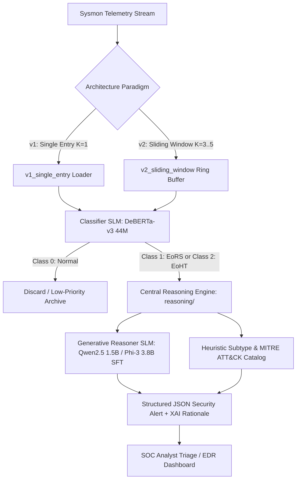

# Specification: System Architecture & Dual-Model SLM Design

## 1. High-Level Architecture
This codebase implements an end-to-end Small Language Model (SLM) framework for **Lateral Movement Detection (LMD)** in enterprise Windows host environments using Sysmon telemetry.



---

## 2. Model Specifications

| Attribute | Classifier SLM | Generative Reasoner SLM |
| :--- | :--- | :--- |
| **Model ID** | `microsoft/deberta-v3-small` (or `distilbert-base-uncased` on DML) | `Qwen/Qwen2.5-1.5B-Instruct` / `microsoft/Phi-3-mini-4k-instruct` |
| **Parameter Count** | **44 Million** | **1.5 Billion** (Qwen) / **3.8 Billion** (Phi-3) |
| **Architecture** | Encoder-Only (Bidirectional Disentangled Attention) | Decoder-Only (Autoregressive Causal LM) |
| **Primary Task** | Rapid 3-Class Sequence Classification | Explainable AI (XAI), JSON Alerting, MITRE ATT&CK Mapping |
| **Classes** | `0`: Normal, `1`: EoRS (Remote Services), `2`: EoHT (Pass-the-Hash) | Structured JSON (`lateral_movement`, `class`, `mitre_technique`, `reasoning`) |
| **Latency (CPU)** | **$\approx 1.1\text{ ms}$ / event** | $\approx 300\text{ ms -- } 1.5\text{ s}$ / alert |
| **Latency (GPU)** | **$< 0.5\text{ ms}$ / event** | $< 15\text{ ms}$ / alert |
| **RAM Footprint** | $\approx 88\text{ MB}$ (FP16) | $\approx 1.5\text{ GB}$ (Qwen INT8) / $\approx 3.8\text{ GB}$ (Phi-3 INT8) |
| **Context Length** | 128 tokens (v1) / 256 tokens (v2) | 512 tokens (v1) / 1024 tokens (v2) |

---

## 3. Directory Layout & Module Responsibilities

```
slm-tr/
├── AGENTS.md                  # Universal AI agent instructions & specifications entrypoint
├── CLAUDE.md                  # Claude Code agent commands & workflows
├── .cursorrules               # Cursor IDE rule definitions
├── specs/                     # Specification-Driven Architecture & Decision Repository
│   ├── README.md              # Index of all architectural specifications
│   ├── 01_ARCHITECTURE.md     # System design & dual-model specifications
│   ├── 02_PARADIGMS_V1_V2.md  # Detailed specs of Phase 1 vs Phase 2
│   ├── 03_REASONING_ENGINE.md # Central reasoning taxonomy & MITRE KB
│   ├── 04_ARCHITECTURAL_DECISIONS.md # Formal Architecture Decision Records (ADRs)
│   ├── 05_BENCHMARKS_AND_DATASETS.md # LMD-2023 & DARPA OpTC specifications
│   └── 06_DEV_WORKFLOW_AND_CLI.md    # Environment, execution, and testing rules
│
├── reasoning/                 # [COMMON] Centralized Reasoning & MITRE Engine
│   ├── mitre_kb.py            # ATT&CK catalog (T1021.002, T1047, T1550.002, T1003.001, etc.)
│   ├── engine.py              # Subtype classification, heuristics, and technical rationale compiler
│   └── prompt_builder.py      # Standardized ChatML prompt/completion generators for SLMs
│
├── v1_single_entry/           # [PHASE 1] Single Event Log Line Paradigm (K=1)
│   ├── data_loader.py         # Single-event text formatter & balanced splitters
│   ├── train_classifier.py    # Sequence classifier trainer on isolated events
│   ├── train_generator.py     # Generative SFT trainer on single-log prompts
│   ├── detect.py              # CLI single-event triage tool
│   ├── eval.py                # Evaluation harness on single-event records
│   └── README.md              # Phase 1 documentation
│
├── v2_sliding_window/         # [PHASE 2] Multi-Event Temporal Sliding Window (K=3..5)
│   ├── data_loader.py         # Multi-event temporal sequence formatter & ring buffer
│   ├── train_classifier.py    # Sequence classifier trainer on temporal sequences
│   ├── train_generator.py     # Generative SFT trainer on multi-event sequence prompts
│   ├── detect.py              # Real-time stateful ring buffer SOC stream monitor
│   ├── eval.py                # Evaluation harness on temporal sequences
│   └── README.md              # Phase 2 documentation
│
├── scripts/                   # Evaluation, benchmarks, and data preparation utilities
│   ├── compare_v1_v2.py       # Side-by-side benchmark comparison tool (v1 vs v2)
│   ├── prepare_optc_benchmark.py # DARPA OpTC out-of-distribution benchmark generator
│   └── setup_dataset.py       # Dataset downloader & Mordor parser
│
├── data/                      # Local telemetry datasets & unified loader wrapper
│   ├── loader.py              # Unified wrapper routing window_size=1 -> v1, >1 -> v2
│   ├── lmd_2023_dataset.csv   # LMD-2023 primary benchmark dataset
│   └── optc_test_benchmark.csv# DARPA OpTC synthesized test benchmark
│
├── detect.py                  # Root CLI threat hunter supporting --variant v1|v2
├── eval.py                    # Root evaluation script supporting --variant v1|v2
├── app.py                     # Streamlit SOC EDR UI with Paradigm Selector and Live Telemetry
├── Dockerfile                 # Multi-stage GPU/CPU Docker container configuration
└── docker-entrypoint.sh       # Containerized background/foreground sequential runner
```
