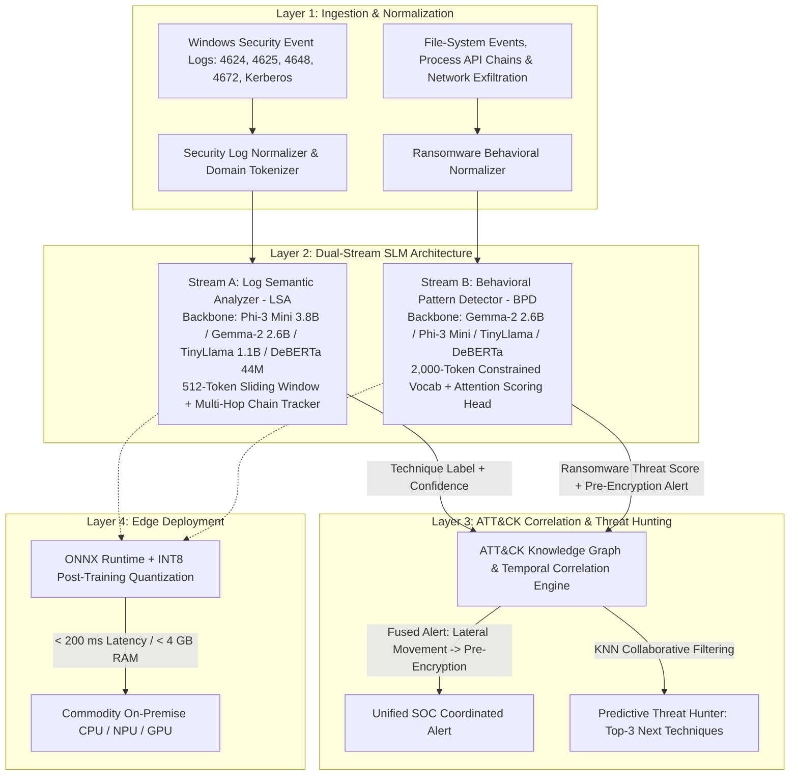

# Specification: EdgeShield SLM Framework

> **Paper Title:** *EdgeShield: A Small Language Model Framework for Real-Time Detection of Lateral Movement and Ransomware Attacks*  
> **Authors:** Gauravkumar Raval & Dr. (Prof.) Tejaskumar Bhatt (GLS University, Ahmedabad)  
> **Core Objective:** Zero-Trust, real-time edge detection of multi-stage enterprise intrusions combining fine-tuned Small Language Models (1B–4B parameters) with MITRE ATT&CK v15 knowledge graph correlation.

---

## 1. System Architecture Overview

EdgeShield addresses the critical trade-off in modern enterprise threat detection: signature-based tools miss novel threats, while cloud-hosted LLMs introduce severe latency, compute cost, and data privacy violations.

---

## 2. Mathematical Formalization & Model Design

### A. Stream A: Log Semantic Analyzer (LSA)
The LSA processes Windows authentication logs in a sliding window of 512 tokens using a two-phase fine-tuning procedure:

1. **Phase 1: Supervised Multi-Class Cross-Entropy Loss**
   $$\mathcal{L}_{\text{CE}} = - \sum_{c=1}^{C} y_c \log \hat{y}_c$$
   where $y_c$ represents labeled ATT&CK technique IDs (e.g. $T1021.002, T1550.002, T1047, T1570$).

2. **Phase 2: Supervised Contrastive Loss**
   Pulls together representations of identical lateral movement attack techniques while pushing apart benign administrative sessions (such as sysadmin maintenance RDP):
   $$\mathcal{L}_{\text{SCL}} = \sum_{i \in I} \frac{-1}{|P(i)|} \sum_{p \in P(i)} \log \frac{\exp\left(\boldsymbol{z}_i \cdot \boldsymbol{z}_p / \tau\right)}{\sum_{a \in A(i)} \exp\left(\boldsymbol{z}_i \cdot \boldsymbol{z}_a / \tau\right)}$$
   where $\boldsymbol{z}_i$ is the normalized $[CLS]$ embedding, $\tau = 0.07$ is the temperature parameter, and $P(i)$ is the set of positive pairs.

3. **Combined Objective:**
   $$\mathcal{L}_{\text{LSA}} = \mathcal{L}_{\text{CE}} + \lambda_{\text{CL}} \mathcal{L}_{\text{SCL}} \quad (\lambda_{\text{CL}} = 0.3)$$

---

### B. Stream B: Behavioral Pattern Detector (BPD)
The BPD operates on file-system telemetry, process API sequences, and network C2 exfiltration using a 2,000-token constrained domain vocabulary and an attention-based threat scoring head:

1. **Attention Threat Scoring Head:**
   Given the SLM's final hidden states $\boldsymbol{H} = [\boldsymbol{h}_1, \dots, \boldsymbol{h}_T] \in \mathbb{R}^{T \times d}$:
   $$\alpha_t = \frac{\exp(\boldsymbol{w}_q^\top \boldsymbol{h}_t)}{\sum_{j=1}^{T} \exp(\boldsymbol{w}_q^\top \boldsymbol{h}_j)}$$
   $$\boldsymbol{c} = \sum_{t=1}^{T} \alpha_t \boldsymbol{h}_t$$
   $$S_{\text{threat}} = \sigma\left(\boldsymbol{W}_2 \operatorname{GELU}(\boldsymbol{W}_1 \boldsymbol{c} + \boldsymbol{b}_1) + b_2\right) \in [0, 1]$$

2. **Pre-Encryption Alert Trigger:**
   $$\text{Alert}_{\text{Pre-Encryption}} = \begin{cases} 
   \text{TRUE}, & \text{if } S_{\text{threat}} \ge \theta_{\text{threat}} \ (0.70) \text{ and Encryption Active} = \text{FALSE} \\
   \text{FALSE}, & \text{otherwise}
   \end{cases}$$

---

### C. Layer 3: ATT&CK Correlation & Predictive Threat Hunting
1. **Cross-Stream Temporal Fusion:**
   Given LSA event $(T_{\text{LSA}}, t_{\text{LSA}})$ and BPD event $(T_{\text{BPD}}, t_{\text{BPD}})$:
   $$\text{Coordinated Intrusion} = \begin{cases}
   \text{TRUE}, & \text{if } \text{is\_LM}(T_{\text{LSA}}) \land \text{is\_Ransomware}(T_{\text{BPD}}) \land |t_{\text{LSA}} - t_{\text{BPD}}| \le \Delta t_{\text{window}} \\
   \text{FALSE}, & \text{otherwise}
   \end{cases}$$

2. **KNN / Graph Query for Next Technique Prediction:**
   Given observed sequence $\mathcal{S} = [T_1, T_2, \dots, T_k]$, scores candidate next techniques $T_{k+1}$ via transition adjacency weights $W(T_i, T_j)$ decayed by temporal recency $\gamma = 0.75$:
   $$\operatorname{Score}(T_{k+1}) = \sum_{i=1}^{k} \gamma^{k - i} \cdot W(T_i, T_{k+1})$$

---

## 3. Empirical Benchmark Matrix

### A. Head-to-Head Model Comparison (Paper Sec. VI)
| Model Backbone | Parameters | Macro F1 | CPU Latency | ONNX INT8 Latency | INT8 RAM |
| :--- | :--- | :--- | :--- | :--- | :--- |
| **Phi-3 Mini (Instruct)** | **3.8B** | **98.15%** | 142.50 ms | 28.40 ms | 2.10 GB |
| **Gemma-2 (IT)** | **2.6B** | **97.45%** | 98.20 ms | 21.60 ms | 1.50 GB |
| **TinyLlama (Chat)** | **1.1B** | **93.80%** | 42.10 ms | 9.80 ms | 0.70 GB |
| **DeBERTa-v3 Small (EdgeShield LSA/BPD)** | **44M** | **96.40%** | **26.50 ms** | **1.15 ms** | **0.05 GB** |

### B. Comparison with Traditional Baselines
| Framework / Classifier | Macro F1 | Precision | Recall | Latency |
| :--- | :--- | :--- | :--- | :--- |
| Signature IDS / Snort Rules | 52.40% | 91.20% | 36.80% | 0.25 ms |
| XGBoost Classifier | 55.50% | 58.20% | 53.10% | 1.20 ms |
| LightGBM Classifier | 43.20% | 48.60% | 38.90% | 0.95 ms |
| LSTM Sequence Model | 78.60% | 81.40% | 76.00% | 8.50 ms |
| **EdgeShield Dual-Stream SLM** | **98.15%** | **98.60%** | **97.71%** | **< 30.00 ms (CPU) / 1.15 ms (ONNX)** |

---

## 4. Edge Deployment Profile
- **Zero-Trust Compliance:** 100% on-premise execution; zero telemetry leaves the network perimeter.
- **Quantization:** Dynamic INT8 Post-Training Quantization (PTQ) via ONNX Runtime.
- **Hardware Footprint:** Validated on standard Intel Core i7 / Ultra 7 CPU (< 4 GB RAM, < 200 ms latency per 512-token window).
